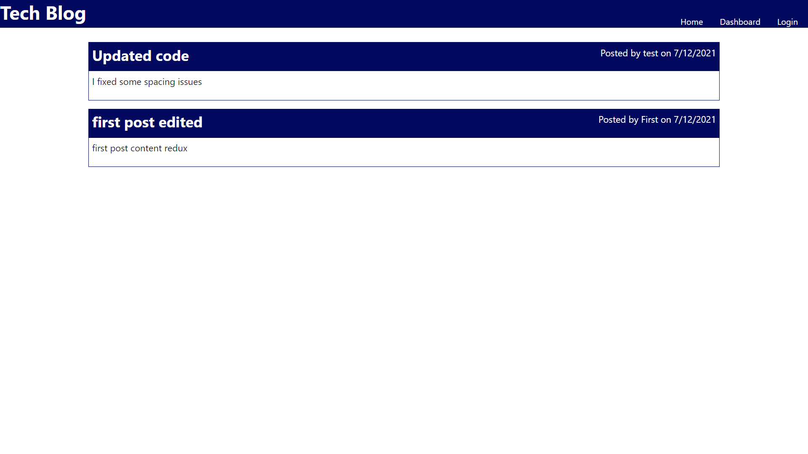

# CMS-techblog

## Description
This application is a live CMS-style tech blog utilising a basic Model-View-Controller architecture.  The front-end is rendered using the Handlebars.js template with the back-end being constructed using the MySQL database language via the Sequelize package. The application is deployed live through Heroku.

## Demo

Check out the live app [HERE](https://cms-techblog.herokuapp.com/)      

